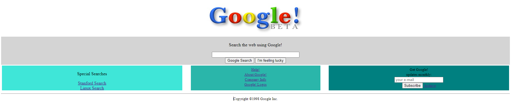

# 1998 Google Clone

Google was founded in 1996 and published its first version in 1998. There is a web archive named [Wayback Machine](https://archive.org/web/) you can view all the websites of the past on the Internet. I tried to implement 1998 version of Google. The buttons are not working for now.

Also, I enjoyed learning web developing with [Kodluyoruz & Patika](https://app.patika.dev/paths). I'd say check their content out.

Here is the homepage:

